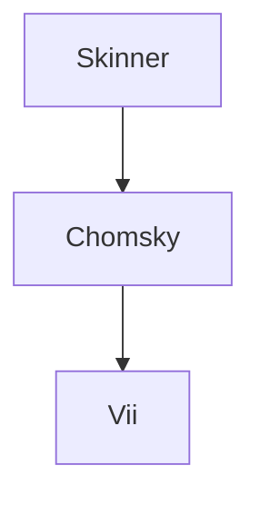

*“Now, let us see if you truly understand what it means to be nightmare.” - Malachai*

### Introduction

This article builds on Chomsky’s sentence “Colorless green ideas sleep furiously.” to argue that in the context of nightmare such sentences can become semantically charged. Let's use a counterexample: “The crunching angry leaves stared menacingly.” but stress that in a dream I walked past a pile of angry leaves which were crunching ever-louder filling me with a sense of profound dread. Suddenly nightmare, an altered state, performs a semantic inversion: creating meaning from empty syntax where none was available, logically. I postulate it may be possible to use this as a point of contact between alien minds, including animal, dream-state, and possibly artificial cognition. Furthermore, I contend that Chomsky's notion of “universality” is intrinsically anthropocentric, excluding biological forms of communication beyond human verbal language. 

---

### Nightmare as Semiotic Portal

Dreams, and nightmares in particular, exist at the intersection of experience and symbolic abstraction. They simulate meaning in emotionally real ways without relying on coherent syntax. In nightmares, ordinary objects loom with significance beyond language’s ability to categorize them as threat and meaning become entangled. Positioning nightmare as a “semiotic portal” allows us to:

1. Open a space for studying meaning outside formal linguistic rules.
2. Links to non-human cognition in a way that doesn’t anthropomorphize but asks: what happens when logic breaks down _and_ meaning still emerges?
3. Include accessing how non-human intelligences, such as bats (per Thomas Nagel’s “What Is It Like to Be a Bat?”), or AI systems might structure or experience meaning.

---

### The Limits of Chomsky’s “Universality”

Chomsky’s model of universal grammar is only as universal as the subjects and methods it engages. His research is grounded in human verbal language and introspective grammaticality judgments. It doesn’t consider how other species encode or decode meaning, nor does it engage with altered states like dreaming, psychosis, or trauma, where traditional grammatical logic may dissolve but meaning still proliferates.

Furthermore, Chomsky’s framework does not account for meaning generation, only the recognition of sentence structure. It presumes a fixed inner architecture rather than engaging with how newness or novelty arises in evolving biological or communicative systems.

#### What this Approach Does Differently

| Chomsky’s Use                                                  | Chomsky’s Nightmare                                                               |
| -------------------------------------------------------------- | --------------------------------------------------------------------------------- |
| Syntax can exist without semantics.                            | Semantics can emerge without conventional syntax.                                 |
| Sentence proves grammatical competence independent of meaning. | Nightmare proves semantic intensity independent of grammar.                       |
| Language is structured by innate mental rules.                 | Meaning is structured by affective, embodied, and possibly non-human experiences. |
| Formal analysis isolates syntax from usage or feeling.         | Embodied analysis reintegrates emotion, perception, and symbolic condensation.    |

By treating “Colorless green ideas sleep furiously” not as meaningless but potentially meaningful within altered states, we're inverting and expanding on the terrain of his initial question: 

> What happens when semantic charge can emerge from non-referential structure, not through logic, but through affect?

By widening the field of Universal Grammar to include affective-semiotic competence, nightmare lets us push toward a plural theory of meaning, with grammar as one species of a broader genus. Where Chomsky cracked open how we produce infinite structured sentences, this approach reveals how we experience infinite forms of meaning, not all of which need structure at all. The nightmare doesn't violate universal grammar; it reveals its limits.

|Feature|Chomsky|Norah Vii|
|---|---|---|
|Domain|Human verbal language|All meaning-making systems|
|Method|Formal analysis of grammar|Phenomenology + semiotics|
|Core Insight|Syntax is independent of meaning|Meaning can emerge independently of syntax|
|Competence|Grammatical rule system|Affective-symbolic engagement|
|Edge Case|"Colorless green ideas..." = meaningless|"Crunching angry leaves..." = meaningful (in dream)|
|Theory Goal|Model Universal Grammar|Propose Universal Semiotic Ground (affective, cross-conscious)|

---

### Toward a Biosemantic Theory of Meaning

A truly universal grammar (or better, a universal semiotics) would not be constrained by linguistic syntax alone. It would address how diverse biological systems (animal, human, artificial) generate, assign, and respond to meaning. Nightmare, as a visceral and emotionally coherent yet grammatically defiant phenomenon, becomes a case study in such a theory.

In this light, nightmare syntax is not broken syntax but a different axis of meaning-making, shaped by threat perception, memory distortion, and symbolic condensation. Hence therapists, researchers, and even AI systems that analyze dream or trauma narratives could use this framework to treat these utterances not as noise, but legitimate semiotic events. It destigmatizes “irrational” language in mental health contexts by reframing it as emotionally coded meaning rather than failure.

If Chomsky had truly sought a universal grammar, he would have had to look beyond sentence structure into the phenomenology of meaning itself. He would have had to study how bees waggle, how trees warn each other, how whales communicate over oceans, and how a child’s nightmare gives semantic weight to nonsense. This is not simply an expansion of linguistics. It is a reconception of what it means to signify. Nightmare reveals the scaffolding beneath universality: a more primal and alien logic through which all meaning begins.

---

### The Middle Way

The nightmare counterexample doesn’t say Skinner was right, but shows that Chomsky wasn’t entirely complete. By ignoring how emotion, perception, and symbolic states generate significance, Chomsky’s universal grammar becomes too narrow to account for non-logical yet meaningful experiences. One remarkable example of this is the use of quantum effects by birds to navigate, possibly birds would tell us a lot about quantum physics and Earth's magnetic fields, but to do so would require crossing through the semiotic portal mentioned previously. This is a third position:

|Skinner|Chomsky|Vii|
|---|---|---|
|Language as conditioned behavior|Language as innate syntactic competence|Meaning as embodied, affective, and semiotic emergence|
|Rooted in empiricism and behavioral conditioning|Rooted in rationalism and formal rule systems|Rooted in phenomenology, semiotics, and altered-state cognition|
|Emphasis on external use and observable function|Emphasis on internal structure and generativity|Emphasis on symbolic intensity, affect, and subjective perception|
|Excludes inner mental life as non-measurable|Abstracts mind from body and emotion|Centers embodied experience as site of semantic production|
|Data derived from observable behavior|Data derived from grammatical intuitions|Data derived from affective states, dream logic, and non-verbal cognition|

---

